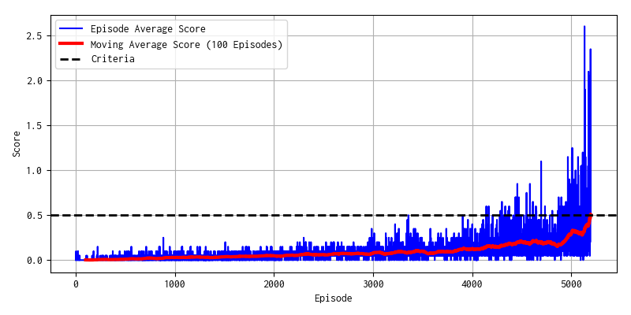

# Performance Report
## Result
Agent met criteria around 5000 episodes.
You can check time series of scores in the chart below:



You can view the agent movement in the simulator
using next script:
``` bash
python view.py
```

## Agent Overview
For project of continuous control, I implemented **PPO (Proximal Policy Optimization)**
algorithm, and inside PPO, I used **GAE (Generalized Advantage Estimation)**
instead of normal advantage implementation.

As policy model, I used **Actor/Critic framework**, in which **actor** output the 
probability of actions or draw actions from the distribution based on the current state,
and **critic** output the state value function. To reduce complexity,
actor and critic shares hidden layers.

**In this project, Udacity recommends multi-agent algorithm, MA-DDPG
for example, but I don't have enough time to implement it. I decided to make it
a future work.**

## Model Detailed
Actor/Critic model shares next hidden layers:
```
Input State(8) -> Dense(512) -> LeakyReLU -> Dense(256) -> LeakyReLU*
```
After that, Actor and Critic generates each output:
```
LeakyRelu* -> Dense(2) -> tanh -> Output of Actor
LeakyReLU* -> Dense(1) -> Output of Critic
```

The output of actor model is used by mean parameter of normal distribution.
When agent plays in simulator, actor draws actions from distribution at random.
When agent updates model based on actions already drew from the model,
actor returns likelihood of actions of distribution.
(Variance parameters of normal distribution are also model parameters)

Because output of agents fluctuates based on normal distribution, agent can reach
optimal parameters in the balance between exploration and exploitation.

## Detailed parameters
- **Discount factor gamma is set to 0.99**, and **GAE lambda 0.96.**.
- Before model update, advantage is normalized to standard normal distribution.
- **PPO clipping parameter (eps) is set to 0.1**.
- Model is updated after each **1024 simulator time steps**.
- Actor/Critic are simultaneously updated using sum of loss of each model.
- Model is updated by mini-batch.
  - Optimizer is Adam. **Learning rate is 1e-4.**
  - **number of epoch is 20**
  - **mini batch size is 128**

## Future Direction
1. **Optimal Parameter Search, or Implement DDPG**  
  It took many (5000) episodes to achieve criteria.
  To overcome this issue, optimal parameters of models are needed.
  In addition, I think PPO/GAE is not suitable for this project.
  Instead of PPO/GAE, I want to check performance of DDPG algorithm.

2. **Implement algorithm ready for Multi-Agent environment**  
  PPO/GAE is general policy-based algorithm, but not suitable for
  multi-agent (needed cooperation) environment, so I implement
  algorithm ready for multi-agent environement, MA-DDPG for example.
